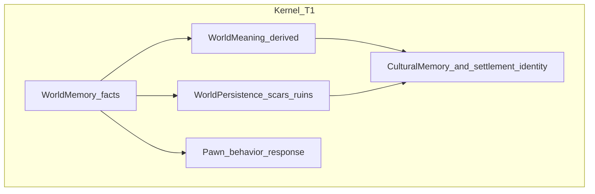

# HEELKAWN — CURSOR MASTER PLANNING SPEC

**Version:** 1.0 (planning umbrella; not a replacement for code state)  
**Purpose:** Single entry point for Cursor and contributors: canon tiers, lore, systems, mechanics, ages, factions, and implementation priorities—aligned with this repository’s authoritative files.

---

## 1. Purpose and how to use

**Read order (strict):**

1. [`docs/HEELKAWN_STATE.md`](HEELKAWN_STATE.md) — engine, phase, kernel list, design rules, next code target. **Wins on any conflict** with this document for “what the project is building now.”
2. [`HEELKAWN.txt`](../HEELKAWN.txt) — short session handoff.
3. **This file** (`CURSOR_MASTER_PLANNING_SPEC.md`) — universe planning, tiers, roadmap layers, tensions.
4. Domain lore as needed — [`docs/WORLD_BIBLE/MASTER_INDEX.md`](WORLD_BIBLE/MASTER_INDEX.md).

Formal canon promulgations (minimal, dated) belong in [`docs/HEELKAWN_CANON_LOG.md`](HEELKAWN_CANON_LOG.md). Do not treat chat or speculative drafts as canon until recorded there.

---

## 2. Canon tiers (reconciliation table)

Use these tiers so kernel truth, setting, product direction, and myth branches stay separable.

| Tier | Label | Binding | Examples |
|------|--------|---------|----------|
| **T1** | Kernel locked | Non‑negotiable for Godot simulation and audit trail | Deterministic causality; facts before intentions; append‑only factual memory; derived meaning never writes facts; UI/HUD reflects state, never overrides it; no RNG in world history (per [`HEELKAWN_STATE.md`](HEELKAWN_STATE.md)); replay/audit posture; observer/chronicler player frame; collapse sequence (trust → legitimacy → knowledge → environment) |
| **T2** | Simulation / setting canon | Setting bible and geography that must not contradict T1 | Prometheus; BayMin (NW), Cythera (SE); “the Crossing”; BT/AT framing as **timeline labels**; biomes/coordinate conventions documented in lore files |
| **T3** | Probable / design intent | Direction for future layers; specify **product track** when relevant | Krond economy; war‑declaration choreography; classes/professions (Bila/Trot/WeiWu/Namaak); Twitch/chat command sets; settlement/kingdom RPG loops on **overlay** tracks |
| **T4** | Exploratory / myth branches | Preserved ideas; not mainline first‑contact unless promoted | Taured / DRUJ / Ark / Proclamation‑style techno‑spiritual resistance arcs; parallel Earth strands; named character clusters — placement: **later age**, **collapsed echo‑world**, **distorted legend**, or **parallel game/expression** |

**Umbrella rule:** HeelKawn is one myth‑engine universe that may host **multiple internally consistent world expressions**. The Godot kernel game is the **human‑scale, consequence‑first** expression. High‑myth branches (T4) do not delete T1–T3; they occupy a different scope unless explicitly promoted in canon logs.

---

## 3. Lore

**Central thesis:** HeelKawn is a **consequence world first**, not a scripted hero ladder. Reality happens; memory tries to keep up—sometimes falsely, contested, or fragmented.

**Kernel vs human history:**

- **Simulation facts** (T1): what the engine recorded (events, locations, ticks, entities).
- **Human history**: witness, records, rumor, myth—contested by design.

**Metaphysics:** Treat as **world‑internal and arguable**. Asha (continuity, restraint, stewardship) and Druj (entropy, pressure, distortion) are **currents**, not a good/evil menu. Express through outcomes and customs, not tutorialized morality.

**Depth without exposition:** incompleteness, legacy over victory, teachers and memory‑keepers weighted over brute dominance, hospitality/taboo patterns, places that carry weight because of prior consequence.

**Expanded lore:** Edit domain files via [`WORLD_BIBLE/MASTER_INDEX.md`](WORLD_BIBLE/MASTER_INDEX.md) (`GAME_VISION.md`, `TIMELINE.md`, `REGIONS.md`, `FACTIONS.md`, `GLOSSARY.md`, `CHARACTERS.md`).

---

## 4. Cosmology and ages

Condensed **Seven Ages ladder** (Full Universal Model — narrative structure; **not** all implemented in code):

| Age | Name (draft label) | Notes |
|-----|-------------------|--------|
| First | Age of Hands | Survival, fire, burial, shelter, naming |
| Second | Age of Hearths | Settlements stabilize; taboos; hospitality |
| Third | Age of Markers | Territory, records, boundaries |
| Fourth | Age of Crowns | Law, dynastic memory, institutional conflict |
| Fifth | Age of Fracture | Trust collapses unevenly; ruins multiply |
| Sixth | Age of Echoes | Fragments, rituals — **natural home for stronger myth/sci‑fantasy branches** (T4) |
| Seventh | Age of Recovery or Masking | Stewardship vs domination disguised as salvation |

**Status:** Structural **draft** suitable for lore and pacing; calendar binding is T2 only where committed in `WORLD_BIBLE/TIMELINE.md`.

**Technical time mapping:** [`docs/TIME_SCALE.md`](TIME_SCALE.md), [`scripts/kernel/sim_time.gd`](../scripts/kernel/sim_time.gd).

---

## 5. Factions

**Rule:** Prefer **emergent** factions (from simulation + history) over **authored** permanent factions.

Kingdom‑of‑Green / Kingdom‑of‑Purple–style examples are **historical illustration** for community/stream eras, **not** mandatory canon names for the Godot kernel unless recorded in lore files.

Authoritative faction tables: [`WORLD_BIBLE/FACTIONS.md`](WORLD_BIBLE/FACTIONS.md).

---

## 6. Systems map (engineering‑facing)

### Memory stack (this repo — matches [`LLM_ONBOARDING.md`](LLM_ONBOARDING.md))

### Interaction overlays (consume truth; do not redefine it)

Commands (Twitch/`!join`, Discord roles, blockchain metadata, WorldBox mod) **emit or display** derived from exports and policies—they must not retroactively rewrite **WorldMemory** facts.

Future web/community scale: [`docs/ONLINE_AND_PVABAZAAR.md`](ONLINE_AND_PVABAZAAR.md).

---

## 7. Mechanics

Split by **delivery layer** so philosophical T1 rules are not silently contradicted.

### Godot kernel mechanics (this repository)

- Fixed tick/time model; deterministic logs; settlement lifecycle; needs/jobs/build; ecology; death and lineage facts; HUD as reflection; diagnostics/export (e.g. history export, kernel diagnostic tick alignment with `SimTime`).
- **Tier:** T1 constraints from [`HEELKAWN_STATE.md`](HEELKAWN_STATE.md); implementation details live in code and [`TIME_SCALE.md`](TIME_SCALE.md).

### PVAGames / WorldBox / stream mechanics (parallel or downstream products)

- **Krond** (kills, passive treasury, spends on traits/magic/elections).
- **Magic tiers** (Trivial → Cataclysmic) tied to Krond or out‑of‑game donation mapping — **community spectacle layer**; effects must still be **logged as facts** if mirrored into kernel exports.
- **War protocol** (council → emissaries → senate → declaration → battlefield hierarchy).
- **Classes/professions** (skills, locks at thresholds, racial spawn tables).

Tag these explicitly **T3** unless promoted; they belong to **overlay/session design**, not to rewriting T1 causality rules.

---

## 8. Implementation priorities

### Near‑term — this repo (authoritative)

Pulled from [`docs/HEELKAWN_STATE.md`](HEELKAWN_STATE.md):

- **Phase:** Phase 4 — Identity & Meaning (settlements autonomous, cultural divergence, abandonment/revival curves, settlement meaning readability, animal ecology).
- **Next targets:**
  - Cultural architectural styles.
  - Player‑readable meaning refinement (audio + settlement identity depth; **no** exposition text overlay as a substitute for simulation).
  - Wildlife HUD trend validation + Phase 4 rebirth threshold tuning passes.

### Medium / long‑term

- Threshold tuning for “scar vs noise,” repetition→history patterns, chronicle/player‑facing interpretation UX that never overrides facts.
- Harden interaction bridges (commands, exports, archival pipelines).
- Online architecture and pvabazaar.org‑class integration — see [`ONLINE_AND_PVABAZAAR.md`](ONLINE_AND_PVABAZAAR.md).
- Human-scale progression ladder and unlock pacing — see [`HUMAN_SCALE_PROGRESSION_LADDER.md`](HUMAN_SCALE_PROGRESSION_LADDER.md).

---

## 9. Explicit tension register

Known tensions in the broader corpus—**resolved by scope**, not by pretending one layer is the other:

| Tension | Resolution |
|---------|------------|
| “No tutorials / no XP ladders” vs Krond/skills/classes | Philosophical stance and **minimal UI teaching** belong to **kernel experience**; explicit progression economies belong to **T3 stream/mod/MMO** overlays unless design merges them deliberately (document in canon changelog). |
| “No chosen heroes” vs named casts (Taured, etc.) | Named arcs are **T4 branches** or later ages; kernel play stays ordinary‑human‑first. |
| Deterministic history vs donation‑triggered spectacle | Spectacle must map to **logged effects** and policies; cannot erase or falsify append‑only facts. |
| Single‑player kernel first vs multiplayer ambition | Validate kernel **before** networking shared truth; see [`GAME_VISION.md`](WORLD_BIBLE/GAME_VISION.md) layers. |

---

## 10. Session handoff hook

- **`HEELKAWN_STATE.md` / `HEELKAWN.txt`:** update when **engineering phase**, kernel completion, or **next code target** changes.
- **This spec:** update when **tier assignments**, umbrella lore structure, or **cross‑layer policies** change—not every commit.
- **`SESSION_LOG.md`:** ongoing work diary per [`LLM_ONBOARDING.md`](LLM_ONBOARDING.md).

---

## Related documents

| Document | Role |
|----------|------|
| [`HEELKAWN_STATE.md`](HEELKAWN_STATE.md) | Authoritative code/project state |
| [`HEELKAWN_STANDALONE_MASTER_PLAN.md`](HEELKAWN_STANDALONE_MASTER_PLAN.md) | Standalone spectator/incarnation build order and feature master plan |
| [`WORLD_BIBLE/GAME_VISION.md`](WORLD_BIBLE/GAME_VISION.md) | Product DNA and inspiration blend |
| [`WORLD_BIBLE/MASTER_INDEX.md`](WORLD_BIBLE/MASTER_INDEX.md) | Lore file map |
| [`HEELKAWN_CANON_LOG.md`](HEELKAWN_CANON_LOG.md) | Formal canon entries only |
| [`TIME_SCALE.md`](TIME_SCALE.md) | Tick/calendar/wall‑clock mapping |
| [`ONLINE_AND_PVABAZAAR.md`](ONLINE_AND_PVABAZAAR.md) | Late online/bazaar integration |
