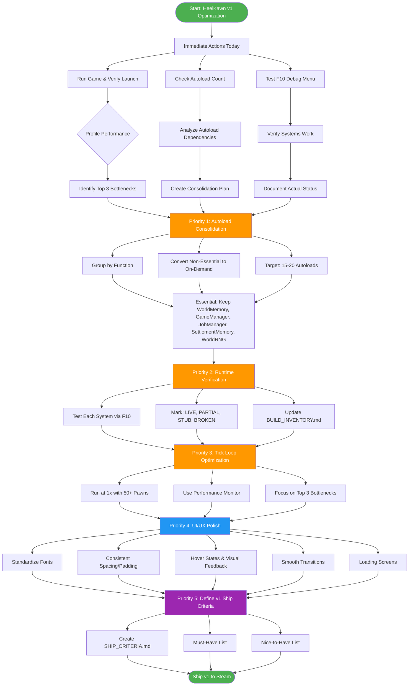

# HeelKawn v1 Optimization Roadmap - Interactive Flowchart

**Created:** May 10, 2026  
**Goal:** Optimize existing systems for smooth Steam-ready performance  
**Current State:** Phase 5 - Emergent Life (~90% complete, 45+ autoloads)

---

## Interactive Flowchart

---

## Task Breakdown with Dependencies

### **Phase 0: Immediate Actions (Today)**
**Time:** 30-60 minutes  
**Dependencies:** None

- [ ] **Run the game** - Verify it launches without errors
- [ ] **Check autoload count** - List all 45+ autoloads in project.godot
- [ ] **Test F10 debug menu** - Verify debug systems work
- [ ] **Document findings** - Note any immediate issues

---

### **Phase 1: Autoload Consolidation (CRITICAL)**
**Time:** 2-4 hours  
**Dependencies:** Phase 0 complete  
**Impact:** Reduces startup time, memory usage, complexity

#### 1.1 Analyze Autoload Dependencies
- [ ] List all 45+ autoloads from project.godot
- [ ] Group by function (Memory, AI, Systems, UI, Debug)
- [ ] Identify which autoloads reference each other
- [ ] Mark essential vs non-essential

#### 1.2 Create Consolidation Plan
**Essential Autoloads (Keep ~15-20):**
- WorldMemory, WorldMeaning, WorldPersistence (core memory)
- GameManager, JobManager, StockpileManager (core gameplay)
- SettlementMemory, SettlementRegistry (settlement systems)
- WorldRNG (determinism requirement)

**Convert to On-Demand:**
- Debug/diagnostic tools (PerformanceMonitor, TickMonitor)
- UI systems that don't need global access
- Optional AI systems

#### 1.3 Execute Consolidation
- [ ] Remove non-essential autoloads from project.godot
- [ ] Convert to regular nodes loaded on-demand
- [ ] Update all references to use get_node() instead of global access
- [ ] Test that game still launches
- [ ] Verify no circular dependencies

---

### **Phase 2: Runtime Verification**
**Time:** 2-3 hours  
**Dependencies:** Phase 1 complete  
**Impact:** Ensures documented systems actually work

#### 2.1 Test Each System
- [ ] Launch game in Godot editor
- [ ] Press F10 → 35 (Backbone/first-play) to see live systems
- [ ] Test each numbered debug option
- [ ] Document what actually works vs what docs claim

#### 2.2 Update Documentation
- [ ] Mark systems as: LIVE, PARTIAL, STUB, or BROKEN
- [ ] Update BUILD_INVENTORY.md with reality
- [ ] Fix any documentation drift
- [ ] Create verification checklist

---

### **Phase 3: Tick Loop Optimization**
**Time:** 3-4 hours  
**Dependencies:** Phase 2 complete  
**Impact:** Improves FPS, reduces hitching

#### 3.1 Profile Performance
- [ ] Run game at 1x speed with 50+ pawns
- [ ] Use Performance Monitor (F10 toggle)
- [ ] Identify which systems consume most tick time
- [ ] Document baseline performance

#### 3.2 Optimize Top 3 Bottlenecks
**Likely bottlenecks:**
- Pawn AI decision making (45+ pawns × complex logic)
- Social rapport calculations (O(n²) pairwise checks)
- Settlement planning (heavy computation)

**Optimization strategies:**
- [ ] Add caching for expensive calculations
- [ ] Implement spatial partitioning for proximity checks
- [ ] Add LOD (Level of Detail) for distant pawns
- [ ] Batch operations where possible
- [ ] Throttle non-critical systems

---

### **Phase 4: UI/UX Polish**
**Time:** 4-6 hours  
**Dependencies:** Phase 3 complete  
**Impact:** Makes game feel professional/polished

#### 4.1 Visual Consistency
- [ ] Standardize fonts (use 2-3 fonts max: body, header, accent)
- [ ] Define color palette (theme colors)
- [ ] Ensure consistent spacing and padding
- [ ] Add hover states for all buttons
- [ ] Add click feedback

#### 4.2 Smooth Interactions
- [ ] Add panel open/close animations
- [ ] Add loading screens for heavy operations
- [ ] Add tooltips for UI elements
- [ ] Smooth camera transitions
- [ ] Add visual feedback for actions

---

### **Phase 5: Define v1 Ship Criteria**
**Time:** 1-2 hours  
**Dependencies:** Phase 4 complete  
**Impact:** Stops scope creep, defines done

#### 5.1 Create SHIP_CRITERIA.md
**Must-Have for v1:**
- [ ] Stable 60 FPS at 1x speed with 50 pawns
- [ ] No red errors in console during normal play
- [ ] All core systems verified working (F10 test pass)
- [ ] Save/load works reliably
- [ ] Player can complete a full game session (birth → death → legacy)
- [ ] Autoload count ≤ 20
- [ ] Memory usage < 500MB
- [ ] No crashes in 1-hour play session

**Nice-to-Have (v1.1):**
- [ ] Advanced AI features
- [ ] Extra polish
- [ ] Additional content

#### 5.2 Final Testing
- [ ] Run 1-hour play session
- [ ] Test save/load multiple times
- [ ] Verify all ship criteria met
- [ ] Create release notes

---

## Parallel Work Opportunities

These tasks can be done in parallel by multiple people/AIs:

- **Person A:** Autoload consolidation (Phase 1)
- **Person B:** Runtime verification (Phase 2)
- **Person C:** UI/UX polish (Phase 4)
- **Person D:** Documentation updates

After Phase 1-2 complete, everyone can focus on optimization and polish.

---

## Quick Reference Checklist

**Before starting:**
- [ ] Read AI_README.md (deterministic kernel rules)
- [ ] Read docs/HEELKAWN_STATE.md (current status)
- [ ] Read PERFORMANCE_OPTIMIZATIONS.md (existing work)

**During work:**
- [ ] Never break deterministic kernel
- [ ] Always use WorldRNG for randomness
- [ ] Record all events to WorldMemory
- [ ] Test after each change
- [ ] Document what you did

**Before shipping:**
- [ ] All ship criteria met
- [ ] No red errors in console
- [ ] Stable 60 FPS
- [ ] Save/load works
- [ ] 1-hour crash-free session

---

## Risk Mitigation

**High Risks:**
- **Autoload consolidation** could break systems
  - *Mitigation:* Test after each removal, keep git checkpoints
  
- **Performance optimization** could introduce bugs
  - *Mitigation:* Profile first, optimize one thing at a time, test thoroughly

- **Scope creep** from "never finished" philosophy
  - *Mitigation:* Define v1 criteria early, stick to it

**Medium Risks:**
- **Documentation drift** between files
  - *Mitigation:* Single source of truth (HEELKAWN_STATE.md)
  
- **AI-generated code** inconsistencies
  - *Mitigation:* Code review, runtime testing

---

## Success Metrics

**Technical:**
- Autoload count: 45+ → ≤20
- FPS at 1x (50 pawns): <30 → ≥60
- Memory usage: Unknown → <500MB
- Console errors: Many → Zero
- Crash rate: Unknown → 0 crashes/hour

**User Experience:**
- Launch time: Slow → <5 seconds
- UI responsiveness: Laggy → Instant
- Visual polish: Inconsistent → Professional
- Feature completeness: Partial → Core v1 complete

---

**Next Action:** Start with Phase 0 (Immediate Actions) - run the game and document what you find.
